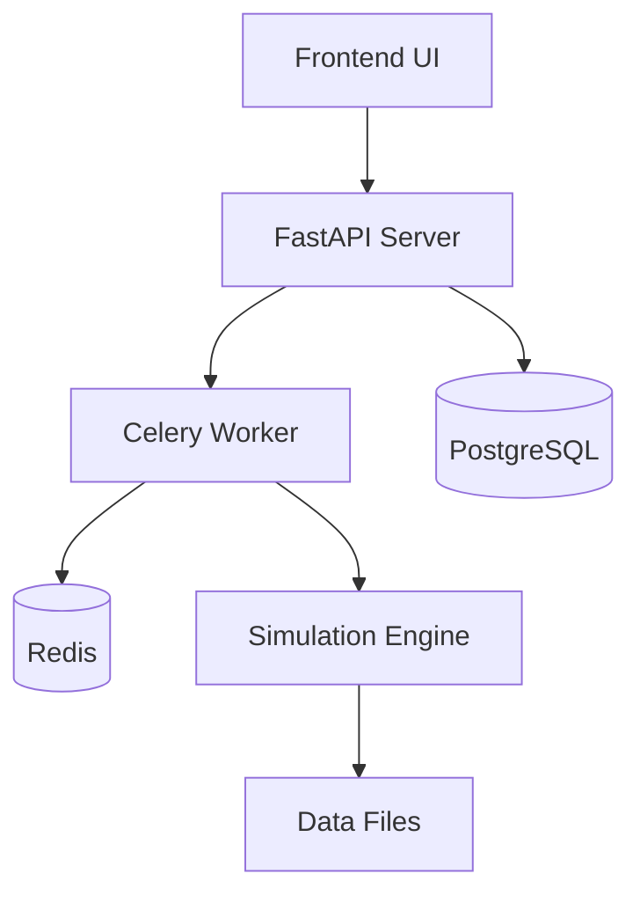

# Digital Twin Simulation Sandbox

Production-grade digital twin for EV battery swap networks.

## Overview

This system allows operators to run what-if scenarios before making real-world infrastructure or policy changes to EV battery swap networks. Built with FastAPI, Celery, PostgreSQL, and Redis.

## Prerequisites

- Docker and Docker Compose
- Git
- Optional: Node.js 18+ (for local frontend development)
- Optional: Python 3.11+ (for local backend development)

## Quick Start

1. **Clone and setup environment:**
```bash
git clone <repository-url>
cd digital-twin
cp .env.example .env
cp frontend/.env.example frontend/.env  # Configure frontend environment
```

2. **Set up Mapbox token (optional for map visualization):**
   - Get a free token from https://www.mapbox.com/
   - Add to `frontend/.env`: `VITE_MAPBOX_TOKEN=your_token_here`

3. **Build and start all services:**
```bash
docker compose up --build
```

3. **Verify services are running:**
```bash
docker compose ps
```

4. **Test the API:**
   - Backend API: http://localhost:8000
   - API Documentation: http://localhost:8000/docs
   - Frontend UI: http://localhost:3000

## Services Overview

| Service | Port | Description |
|---------|------|-------------|
| Frontend | 3000 | React + Vite user interface |
| API Server | 8000 | FastAPI backend with simulation endpoints |
| PostgreSQL | 5432 | Primary database for metadata |
| Redis | 6379 | Task queue and caching |
| Celery Worker | - | Background task processor |

## Frontend Features

Phase 3 includes a complete React-based UI:

- **Home Dashboard** - System overview and quick navigation
- **Scenario Submission** - Form to create and submit simulation scenarios
  - Configure city zones and stations
  - Define interventions
  - Set simulation duration
- **Job Monitor** - Real-time tracking of running simulations
  - Auto-refresh every 3 seconds
  - Progress tracking
  - Job status updates
- **Results Dashboard** - Comprehensive visualization
  - KPI summary cards (wait time, utilization, ROI, etc.)
  - Interactive charts (Recharts)
  - Station performance metrics
  - Artifact file paths
- **Station Map** - Mapbox GL visualization (requires token)
  - Interactive station markers
  - Zone visualization
  - Station details popup

## API Endpoints

### Submit Scenario
```bash
POST /api/scenarios/submit
{
  "description": "Test scenario",
  "city_config": {
    "zones": ["downtown", "suburb_north"],
    "stations": [...]
  },
  "interventions": {},
  "simulation_duration": 3600
}
```

### Get Job Status
```bash
GET /api/jobs/{run_id}/status
```

### Get Job Results
```bash
GET /api/jobs/{run_id}/result
```

## Development Workflow

### Starting Services

**Start all services:**
```bash
docker compose up -d
```

**Start specific services:**
```bash
# Database services only
docker compose up -d postgres redis

# Backend services
docker compose up -d postgres redis api worker

# Full stack
docker compose up -d
```

### Checking Service Status

```bash
# View running containers
docker compose ps

# Check service logs
docker compose logs api
docker compose logs worker
docker compose logs postgres
docker compose logs redis

# Follow logs in real-time
docker compose logs -f api
```

### API Testing

**Health Check:**
```bash
curl http://localhost:8000/health
```

**Submit Test Scenario:**
```bash
curl -X POST "http://localhost:8000/api/scenarios/submit" \
  -H "Content-Type: application/json" \
  -d '{
    "description": "Test scenario",
    "city_config": {
      "zones": ["downtown"],
      "stations": [{
        "station_id": "st_001",
        "lat": 40.7128,
        "lon": -74.0060,
        "chargers_total": 4,
        "zone_id": "downtown"
      }]
    },
    "simulation_duration": 60
  }'
```

**Check Job Status:**
```bash
curl http://localhost:8000/api/jobs/{run_id}/status
```

### Rebuilding After Changes

**Rebuild specific service:**
```bash
docker compose build api
docker compose up -d api
```

**Rebuild all services:**
```bash
docker compose build
docker compose up -d
```

## API Endpoints

### Core Endpoints
- `GET /` - API information
- `GET /health` - Health check
- `GET /docs` - Interactive API documentation

### Simulation Endpoints
- `POST /api/scenarios/submit` - Submit simulation scenario
- `GET /api/jobs/{run_id}/status` - Get job status
- `GET /api/jobs/{run_id}/result` - Get simulation results
- `GET /api/jobs` - List all jobs
- `DELETE /api/jobs/{run_id}` - Cancel job

## Configuration

Key environment variables in `.env`:

```env
# Database
POSTGRES_DB=twin
POSTGRES_USER=twin_user
POSTGRES_PASSWORD=twin_pass

# Redis
REDIS_URL=redis://redis:6379/0

# External APIs
MAPBOX_TOKEN=your_mapbox_token_here
OPENAI_API_KEY=your_openai_key_here

# Security
SECRET_KEY=your-super-secret-key
```

## Data Storage

Simulation artifacts are stored in:
```
/data/results/<run_id>/
├── events.ndjson    # Event log
├── frames.ndjson    # Frame snapshots  
└── summary.json     # KPI summary
```

## Troubleshooting

### Service Won't Start
```bash
# Check logs for errors
docker compose logs <service-name>

# Restart specific service
docker compose restart <service-name>

# Full restart
docker compose down && docker compose up -d
```

### Database Connection Issues
```bash
# Check PostgreSQL health
docker compose exec postgres pg_isready -U twin_user

# Check Redis connection
docker compose exec redis redis-cli ping
```

### Task Processing Issues
```bash
# Check worker status
docker compose logs worker

# Check Redis queue length
docker compose exec redis redis-cli llen celery

# Restart worker
docker compose restart worker
```

### API Not Responding
```bash
# Check API logs
docker compose logs api

# Test API directly
curl http://localhost:8000/health

# Restart API service
docker compose restart api
```

## Development

### Local Development Setup

**Backend:**
```bash
cd backend
python -m venv venv
source venv/bin/activate  # or `venv\Scripts\activate` on Windows
pip install -r requirements.txt
uvicorn main:app --reload --port 8000
```

**Frontend:**
```bash
cd frontend
npm install
npm run dev
```

### Testing
```bash
# Test API endpoints
curl http://localhost:8000/docs

# Check service health
docker compose exec api curl http://localhost:8000/health
```

## Team Rules

- Nobody commits directly to main
- Every task happens in a feature branch
- Every PR requires review
- Master context must be updated before architecture changes
- Docker is the source of truth

## File Ownership

**You own:**
- backend/simulation/
- backend/schemas/
- backend/configs/
- digital_twin_master_context.md

**Friend owns:**
- frontend/
- backend/api/
- docker-compose.yml
- backend/tasks.py

**Shared (coordinate first):**
- backend/models/
- backend/database/
- backend/requirements.txt

## Architecture



## Support

For issues or questions:
1. Check the troubleshooting section above
2. Review service logs: `docker compose logs <service>`
3. Ensure all prerequisites are met
4. Create an issue with detailed logs and steps to reproduce
